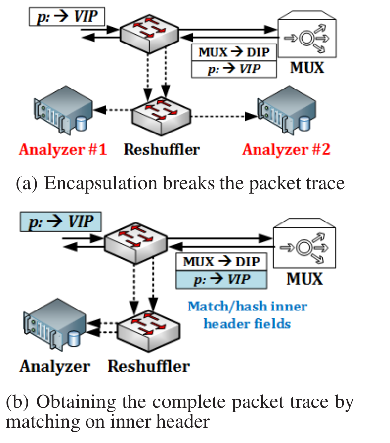
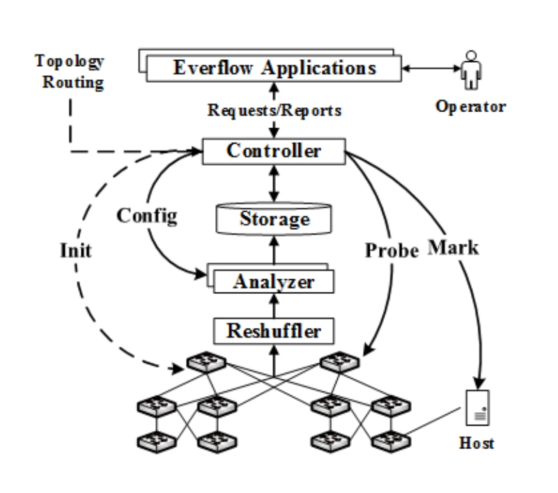
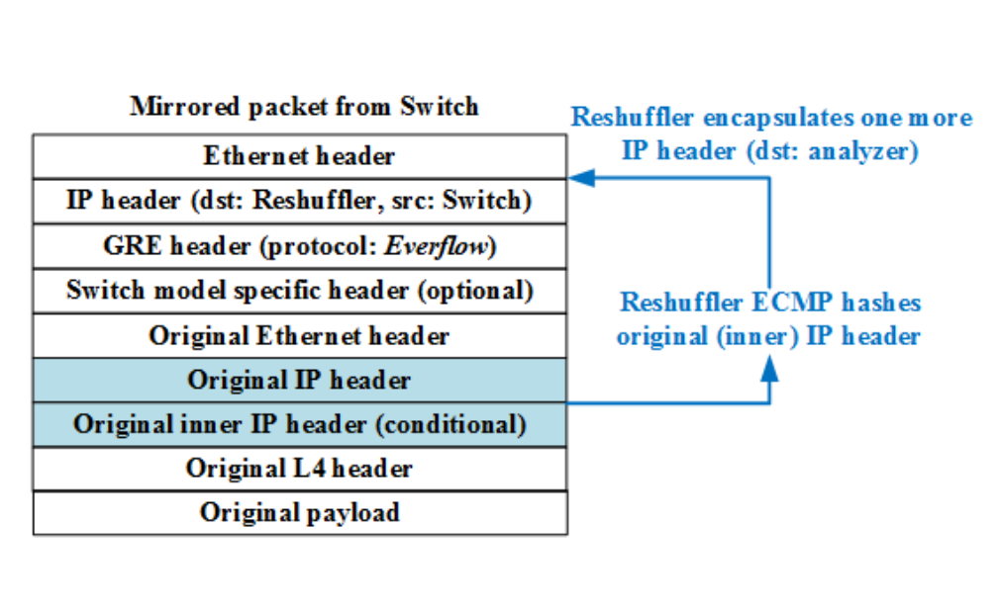

<!-- # 开题报告 -->

<!-- 面向数据中心网络的流量分析与故障检测 -->

## 选题依据及意义

  数据中心被目前的企业中所广泛采用, 大型的数据中心甚至承载着公司的服务系统. 其中
服务器与服务器之间几乎完全是通过现代网络所连接. 对于庞大的系统来说, 各种问题均有
可能发生. 一旦出现, 就会影响着数据中心上承载的服务.

  面对大型复杂数据中心的调试以及错误, 如果仍然使用简陋的单机调试手段, 例如ping,
tracerout是无法满足运营要求的. 进而, 许多公司提出了自己的方案, 甚至为自己的集群
开发出一套相匹配的网络调试工具.

## 研究目标和主要内容(含论文(设计)提纲)

  在数据中心网络(DCN)中, 众多网络设备运行过程中的故障在所难免, 及时发现故障并确定
故障位置成为DCN网络运维的重要组成部分. 本课题参照微软提出的Everflow故障检测方案,
设计实现一款面向数据中心网络的流量分析工具.


## 文献综述: 国内外研究现状, 发展动态

  不论是学校还是企业, 许多都设立了自己的数据中心, 有关数据中心的网络故障检测, 都提出了自己的
见解与考量. 对于更为大型的数据中心网络, 更是有人提出了集学校公司之力, 共同开发系统, 不断的部署
与完善.

  经过对国内外近期文献的查阅, 我发现, 这些系统或是工具可以按照不同角度进行分类. 在主动性方面,
有主动探测故障的, 有被动触发, 还有使用日志记录来查看的; 在网络层次方面, 有些在数据包层面, 有些
则专注于数据流层面; 根据部署位置不同, 也可以分为在交换机部署, 在终端部署, 两者均进行部署; 在
使用范围上, 有些适合于通用平台, 有些只能适用于某个特定厂商; 在处理上, 有些拥有流水线来处理结果,
有些则是简单的排除错误; 按工具性质来看, 有些属于调试小工具, 专注于某个方面, 也不需要一直在线,
有些则是属于系统级别的服务工具, 为整个DCN所使用的服务, 需要一直在线; 而后在错误处理上, 有些
可以借助控制设备自动进行处理, 而有些则需要向管理员预警, 手动进行处理. 以下为各个方案的一些特点
介绍.

  Planck: \ref{rasley2014planck} SDN的出现使得自己调节的网络得以实现, 这样
的网络可以实时监控, 并能立即对重要的事件例如拥塞做出迅速反应. 但是目前的监控机制
需要数百毫秒来重新探测全局网络, 对于实时的错误, 这样的延迟是很致命的, 这篇2014年
的论文提出了新颖的网络测量架构, 使用端口镜像的机制来提取网络信息. 但是可以在相当
短的时间内对网络信息进行获取. 而且不会对网络造成太大的影响.

  LossRadar: \ref{li2016lossradar} 属于有针对性的工具, 着重介绍有关丢包的抓取
问题. 虽然只是检测丢包, 但是这也足够成为一个检测系统了, 这个工具可以在较快的时间
内抓取单独的丢包以及他们的详细信息. 他需要在交换机上部署, 但是并不需要很多的流量
和带宽. 也基于它开发了一些应用程序.

  Cherrypick: \ref{tammana2015cherrypick} 一个可扩展的简单的轨迹追踪技术 
目前的数据轨迹追踪需要负担大量数据积累的开销, 或是在数据平面大量资源的消耗,
交换机规则或是数据包头部的探查. 核心思想是挑选链接, 这些链接是表示数据包端到端
路径的关键, 并在到达目的地的路上将其嵌入数据包头部. 通过使用最新的头部标示技术,
它只需要很少的交换机规则即可, 

  SDN traceroute: \ref{agarwal2014sdn} 使用具有了SDN功能的设备, 不过只要
支持OpenFlow1.0的设备即可. 他可以通过SDN支持的网络中的任意数据包来确定路径,
这个路径使用SDN支持的转发机制, 而且并不需要修改转发规则. 可以探测任意的以太网
数据包的转发行为, 以及交换机和控制器逻辑中的调试问题.

  PathDump: \ref{tammana2016simplifying}使用了较为不同的方法, 仔细划分了边缘
设备与网络元素之间的调试任务. 利用边缘设备的资源进行网络调试的简约工具. 并且可以
支持大量网路调试问题. 需要的资源较少, 而且在较细的时间粒度调试.

  Pingmesh: \ref{guo2015pingmesh} 这个系统已经在微软的数据中心部署了超过4年,
他的理念很简单, 就是想要在任意时刻获取任意两台服务器的延迟信息. 因此, 他的目标就是
去定义一个网络延迟检测和分析系统, 他也需要为所有的服务器产生延迟信息, 因为延迟数据
属于基础信息, 能够帮助我们更好的管理网络, 以及解决网络中的问题. 这项服务也必须
长期在线, 并保证稳定性. 他可能是最不需要关心路由器等设备的一个方案了, 对于整个系统
来说, 知道延迟就是目标, 在实现时, 主要借助了ping的思想, 所有服务器要从中心控制器
下载文件, 进行延迟探测后传回中心服务器. 他借助了微软自己开发了存储系统, 也实现了
数据处理流水线. 相比于之后提出的Everflow, 他更像是微软的第一代产品, 稳定而强大.

  NetSight: \ref{handigol2014know}, 这是一个完全记录网络历史的工具.
在文章中, 介绍了如何使用packet histories(每个包的整条记录)来简化网络的调试.
为了展示`packet histories`的作用, 以及实现上的可行性, 创造了`NetSight`,
一个可扩展的平台, 允许程序简便的检索网络的历史状况. 在`NetSight`上, 有4个程序:
可交互的网络调试器, 实时的监视器, 一个历史记录器, 一个分级分析器.
在一个现代的多核服务器上, `NetSight`可以处理历史包在10G/s的链接中. 对于更大的
网络, 它可以通过增加服务器或是硬件 或是交换机的数量来扩展.
  需要借助SDN, 支持Openflow的交换机才能配合工作, 由于其记录了数据包的历史, 所以
能最大程度还原当初的网络模型, 也因此会给网络带来高负荷, 性能也会损失, 当然也可以
通过增加硬件来进行提升. 这是一个与Everflow较为相似的产品, Everflow中对其一个
重要的改进就是增加了匹配模式, 对特定的历史包生成记录, 能有效减少网络负载, 以及处理
难度.

  Netography: \ref{zhao2016netography} 这也是一种基于软件定义网络(SDN)的
一个工具, 之前的工作关注于静态检查, 被动监控, 以及活动探针, 这些依赖于控制设备以及网络
设备的抓取规则.
 他定义了一个数据包行为的概念, 用以描述数据包的真实变化, 并强调对故障排除的重要性. 基于通过
由主动发送的探测器触发的副本导出分组行为和流规则的新颖方法, 提出了Netography系统, 并说明了
关于转发错误时的排除任务过程, 以及由非租户争用造成的性能下降问题.

  Dissecting RTT(round trip time): \ref{marchetta2014dissecting} 与其说他
是工具, 不如认为这一种技术, 利用单个数据包探测延迟的技术. 研究人员
与操作者经常会在监控, 故障排除, 或是其他方式访问网络路径时 测量往返时间, 因为它结合
了所有跳的过程以及转发和反向路径, 很难去衡量特定网络元素的
延迟. 在这项工作中, 我们提出了一种新的方法: 在区块中,  映射特定路径后 基于单个数据包探测往返
延迟. 使用针对中间路由器的IP Prespecified Timestamp选项, 它可以提供慢速路径部分的往返时间
估计. 这个技术在Everflow中也被用到了, 用于探针方法测量时延.

  Everflow: \ref{greenberg2016packet} 这也是微软推出的工具, 属于数据包层面的
调试器, 该技术有两个优点, 仅需要具有"Match and Mirror"商用交换机即可, 而且可以
自定义的发送探针来进行测试. 也在微软的数据中心部署了超过6个月. 基于数据包层面的分析
可以有效获得整个系统的信息, 环路或是丢包等的常见问题有所探讨,  并且对于一些厂商
定制的协议, 例如RDMA流量的分析上, 也能具有很强大的分析功能.

  Passive Realtime Datacenter: \ref{roy2017passive} 这是在Facebook的数据
中心上进行测试的一种方案,  他不去简单的观察异常现象, 而是考虑异常对整个系统的性能
所造成的影响. 虽然是基于这么一种简单的设想. 但其实现需要深深结合数据中心的架构.
他们开发了轻量级的包标记技术, 仅仅使用转发规则(交换机支持). 作为路径中唯一标示.
文章中对于数据包头部, 现有IPv6头部还很难寻求一份区域用于调试.


## 方案论证.

  本次毕业设计基于微软推出的设计方案Everflow\ref{greenberg2016packet}, 通过
解析数据包层面的信息
进行网络分析. 本次的系统可行性将由以下几个方面进行说明. 但请知悉, 本次毕业设计的
重点部分为分析器以及提供交互功能的控制器, 并依照控制器提供的API进行上层软件开发,
交换机的配置以及存储器的仅作简要说明, 并不影响整体设计.

而且, 本方案中只讨论了在5跳之内的数据中心结构, 假定没有NAT协议, 也就是说源


### 任务书内容

任务包括:
  1. 对实时采集到的数据包进行分析, 实现丢包检测,环路分析或时延异常等故障检测;
  2. 按需保存Trace数据并在必要时生成主动探测包, 以进一步确定故障位置和故障原因;
  3. 针对上述故障检测需求进行应用界面的开发, 具备统计分析, 异常报警等功能.

原始条件及数据: 
  1. 提供用于实验开发的软硬件环境和相关设施;
  2. 提供相关的技术资料和可离线使用的流量数据;
  3. 安排相关研究生给予一定的指导和协助.

工作要求:
  1. 开题之前拟定详细的工作计划; 每周以书面形式报告进展情况; 遵从实验室内部工作安排;
  2. 严格按进度安排完成各阶段工作, 遇到问题及时反馈, 在解决问题的过程中提高应变能力.


### 设计架构

  对于整个的Everflow系统, 它的输入应该是由交换机镜像后的数据包. 在
"match and mirror"方面, 使用了商用交换机的SPAN(Switch port analyzer)技术,
将数据镜像并封装为GRE数据包, 关于交换机的过滤规则: 对于像BGP, PFC以及RDMA这样的
特殊且重要的协议, 采取全部镜像的策略, 而对于TCP连接这种: 只镜像包含SYN, FIN, 和
RST的数据包, 这样既达到了探测效果, 又大大的减少分析器的开销.

{width=70%}

  经过封装之后的数据包p将会传入至分析器中, 见图\ref{mux}.
  但为了负载均衡, 在传入分析器之前,
还要经过一层由交换机改装好的复用器(图中MUX), 之后会再经过
洗牌器发往不同的分析器中进行分析. 这一过程虽然经过多个设备, 但这些设备均是交换机,
具有较快的处理数据包的速度.

  虽然我们是在数据包层面分析问题, 但是我们想要得到的还是整个数据流传输时的情况, 这里
洗牌器这个设备承担了比较重要的工作, 具有同样5元组信息(源IP, 目的IP, 源端口, 目的端口
和协议类型)的数据包将产生同样的hash值,
通过hash值确定要传递到的分析器, 可以保证一整条数据流中的所有数据包均被传递至相同的
分析器.

{width=60%}

  图\ref{arch}中介绍了整个系统的结构,

  分析器读入产生的数据包后. 进行初步的处理, 而后存入存储器中供控制器使用.
在分析器中, 我们可以获得整条的数据包路径, 通过路径, 我们可以得知是否有环, 或是
有丢包现象. 以及对于特定的模式进行统计, 对于探针来说也可以粗略的衡量延迟.

  分析结束后, 并不是所有的结果都要存入存储器, 只有异常行为数据流, 有debug标志的
数据流, 重要协议(BGP, PFC等)会被记录到存储器中.

  控制器最重要的功能就是向外提供API接口. 除此之外, 控制器可以对分析器配置, 向交换机
中发送探针, 而后根据分析器的结果, 目前我们能够提供
的API包括 按时间查找数据流, 查询计数器的值, 添加探针, 在指定的服务器上添加标志位.

  通过控制器的几个接口, 我们以此来进行上层程序设计, 本次设计中要求的使用图形界面
展示结果, 以及添加异常报警功能, 在拥有了以上的API后, 这样的功能实现起来并不困难.


### 技术选型

  此次系统设计, 技术选型主要包括分析器, 存储器, 以及控制器, 上层应用程序的设计.

  对于本次的系统设计, 主要通过Python实现, 期间某些静态库的编写使用C/C++完成.
  存储器可能选择MySQL作为存储, 控制器的API接口采用HTTP协议交互, 最终的展示页面,
功能配置也将在网页上进行操作, 其中, 图表展示打算使用开源的echarts.

### 主要算法说明

**检测环路算法**: 检测环路应该是几个算法中最为简单的一个, 只需要遍历数据流的所有节点,
   如果不存在相同的节点, 那么可以认为此流量中没有环.

**检测丢包算法**: 查看路径的最后一跳是否与我们期望的最后一跳相同. 最后一跳的交换机
是无法直接计算得到的, 需要根据数据中心的网络拓扑进行分析.

**使用探针检测任意交换机的延迟**: 这是一个比较具有考量的方法. 使用了交换机的解封
和转发这一能力.

  首先介绍如何实现一跳的探针: 假设我们想要将数据包p发往S, 我们首先根据p构造出$p^{'}$
其中$p^{'}$的目的IP为S, 而后将$p^{'}$发送出去, 当他到达交换机S后, 数据包中的
目的IP与S的IP相同, 则将数据包$p^{'}$进行解封操作, 将其还原为p, 再正常的转发规则
处理p.

  实现了一跳的探针后, 我们可以考虑将探针进行拓展, 使其按找我们理想的路径进行传递,
方式也不难理解, 就是一层层的进行数据包封装, 这样数据包到达交换机被解封后, 就可以
根据内层的数据包进行正常转发了, 从而达到内层数据包所要去的地址中. 对于端到端的延迟,
例如我们想要知道$S_{1}$到$S_{2}$的往返延迟, 需要对原始数据包进行封装: 第一层,
以$S_{1}$的IP为目的IP, 第二层, 以$S_{2}$的IP为目的IP, 第三层, 再次将$S_{1}$
的IP作为目的IP. 数据包就会按照$S_{1} -> S_{2} -> S_{1}$的方式进行传递. 我们
可以通过此种方法得到粗略的往返延迟.

  为什么说粗略呢, 这里, 并不是在交换机$S_{1}$上直接获取到了两次数据的间隔时间,
我们只能得到到达分析器的时间, 因为认为$S_{1}$到分析器来回路径是一致的, 因此可以
简单的使用分析器获得的两个时间相减得到粗略的往返延迟.

### 主要数据结构说明

  这里的数据结构包括

#### Track 数据

{width=60%}

  对于到达分析器的数据包来说, 均是使用GRE(Generic Routing Encapsulation)
进行封装, GRE格式见图\ref{gre_packet}.

  分析器中存储结构: 基于由于上述分析, 传入任意的分析器中的是一个个单独的数据包,
分析器中, 需要还原整条路径, 但是一条路径上数据包信息是相同的, 所以保存一份即可.
这里是还原后采用的trace路径表示形式.

另外对于每一条trace数据, 还具有一些元数据, 用以表示本trace数据的各种信息.

```cpp
typedef struct{
    uint32_t src_ip;    //源 IP 地址,32bits
    uint32_t dst_ip;    //目的 IP 地址,32bits
    uint16_t ip_ID;     //标识符,16 bits
    uint8_t protocol;   //协议字段,8 bits
}IP_PKT_KEY_T;

typedef hop_info {
    uint16_t switch_id;
    uint16_t rcvd;
} HOP_INFO_T;

typedef struct{
    IP_PKT_KEY_T key;

    uint32_t hop1_timestamp;    // 时间戳
    uint16_t switch_id[5];      // 只保留交换机id
    uint16_t hop1_rcvd : 2;     // 交换机收到的报文数


    uint16_t used : 1;
    uint16_t rcvd : 5;
    uint16_t hop2_rcvd : 2;
    uint16_t hop3_rcvd : 2;
    uint16_t hop4_rcvd : 2;
    uint16_t hop5_rcvd : 2;
    uint16_t hop2_timestamp : 10;
    uint16_t hop3_timestamp : 10;
    uint16_t hop4_timestamp : 10;
    uint16_t hop5_timestamp : 10;
} PKT_TRACE_T;


struct trace {
  void* packet_content; // 数据包信息
  list* hop_info; // 每一条信息, 包括每一跳的时间戳, TTL, MAC等的头部信息
  void* metadata; // 是否设置debug位, 是否错误, 错误为丢包或是其他
};
```

除此之外, 分析器中还有计数器, 记录每个规则下的trace数据个数.

#### 存储器结构

存储器中的结构: 使用关系型数据库进行存储, 存储路径的数据表分为三大部分.

  第一部分是数据包原始信息, 包括数据包头部以及负载信息.

  第二部分是每一跳的信息, 比如时间戳, 源MAC地址. 每个trace数据跳数不同, 所以保存
    时, 将所有跳的信息结合在一起存储.

  第三部分是元数据信息, 表示这个trace信息是否有环, 是否丢包, 是否为探针数据.

* 以下为

| Field         | Type          | Comment                            |
| ---           | ---           | ---                                |
| id            | int(11)       |                                    |
| s_ip          | int(11)       | 源IP                               |
| d_ip          | int(11)       | 目的IP                             |
| protocal      | int(11)       | 协议类型                           |
| generate_time | timestamp     | 产生时间                           |
| trace_data    | varchar(1024) | trace数据信息, 保存为二进制字符串  |
| fdate         | int(11)       | 存入日期, 如果数据量过大则使用索引 |
| is_loop       | int(11)       | 是否有环                           |
| is_drop       | int(11)       | 是否丢包                           |
| is_probe      | int(11)       | 是否为探针                         |

| Field         | Type          | Comment      |
| ---           | ---           | ---          |
| id            | int(11)       |              |
| counter_name  | varchar(1024) | 计数器名称   |
| generate_time | timestamp     | 数据产生时间 |
| analyer_id    | int(11)       | 分析器ID     |
| cnt           | int(11)       | 计数值       |
| fdate         | int(11)       | 数据产生日期 |


### Controler API 接口

  采用http协议对外提供接口, 以下为主要接口

### 未来可进行的优化

  分析器中接受数据包时, 可以使用RSS(Receiver Size Scaling). 允许使用多个CPU
核来接受数据包.

### 程序部署相关

  从理论上来说, 分析器, 存储器, 控制器以及最终展示的应用程序, 几个组件应该放置在
不同的服务器上, 为了开发方便, 暂时将其放在一台服务器上. 但这并不说明程序应该这样,
由于使用socket进行通讯, 所有的组件均可分开部署.

## 进度安排


|   起止日期     |  工作内容                                |备 注              |
| ----          |      -----                            | ----             |
| 2018.1—2018.3	| 查阅文献, 了解需求, 撰写开题报告	         | 除报告撰写, 论文翻译外, 老师提供了一组trace数据包, 初步进行了trace数据的解析, 为之后的分析器设计奠定基础  |
| 2018.3—2018.4	| 设计实现面向DCN网络的流量分析与故障检测方案	 | 实现整个系统: 包括分析器, 存储器, 控制器及上层软件的设计   |
| 2018.4—2018.5	| 进行测试与完善, 着手撰写毕业论文	        |    |
| 2018.5—2018.6	| 提交毕业论文, 完成论文答辩	            |       |

