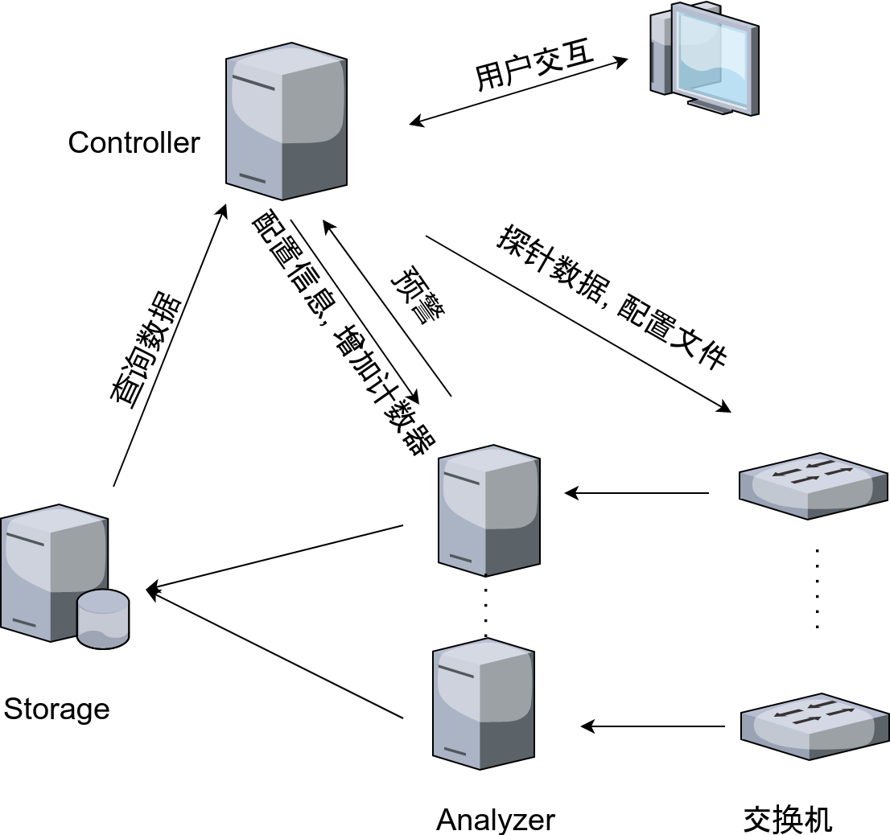
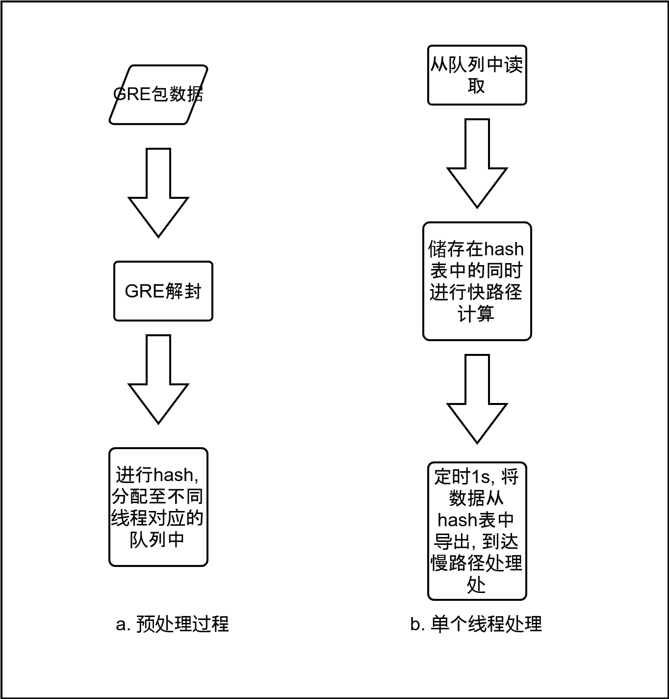
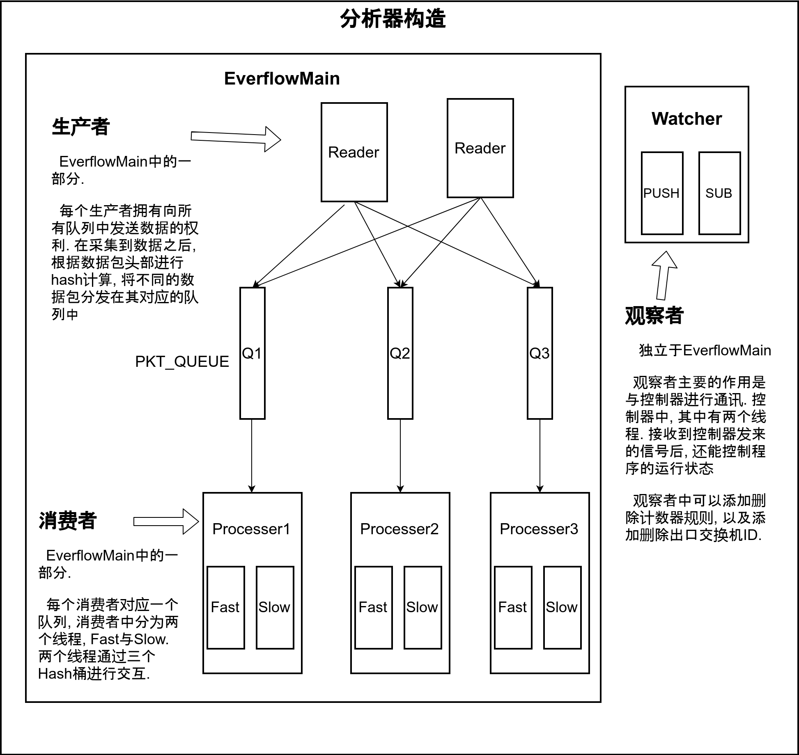

## 选题依据及意义

数据中心被目前的企业中所广泛采用, 大型的数据中心甚至承载着公司的服务系统. 其中
服务器与服务器之间几乎完全是通过现代网络所连接. 用户对网络性能的要求日益扩大,
一些微小故障, 很可能会造成用户体验的下降, 特别是在某些交互敏感的场合.
服务的质量必须得到保证. 可是对于庞大的系统, 各种问题的发生是无法避免的. 我们
只能更快, 更精准的解决问题, 以此将故障的危害降到最低. 这也是对新时代的检测调试
工具的挑战.


面对大型复杂数据中心的调试以及错误, 如果仍然使用简陋的单机调试手段,
例如ping, tracerout, 也许可以解决问题, 但其代价与耗时, 是无法满足运营要求的.
进而, 许多公司提出了自己的方案, 甚至为自己搭建的集群开发出一套相匹配的网络调试工具.


## 研究目标和主要内容(含论文提纲)

在数据中心网络(DCN)中, 众多网络设备运行过程中的故障在所难免, 及时发现故障并确定 
故障位置成为DCN网络运维的重要组成部分. 本课题参照微软提出的Everflow故障检测方案,
设计实现一款面向数据中心网络的流量分析与故障检测工具.

为了解决现实存在的数据中心的网络异常问题, 利用现有交换机的"Match and Mirror"
机制, 将特定的数据包进行镜像. 分析镜像后的数据包, 以达到对网络中存在问题的检测.

本次设计中, 将会基于通用的处理器平台, 关注于DCN中环路的检测, 结果保存, 预警,
数据展示, 探针构造几个方面. 初步实现Everflow功能的基础上, 进行了简单的改进完善,
以下列出了程序的主要功能:

* 对实时采集到的数据包进行分析, 实现丢包检测,环路分析或时延异常等故障检测;
* 加入了对快慢路径两种不同的分析方案;
* 在分析时, 多处使用hash数据结构来加快查找, 以加快处理速度;
* 按需保存Trace数据并在必要时生成主动探测包, 以进一步确定故障位置和故障原因;
* 采用B/S架构, 管理员通过浏览器即可进行操作

## Everflow功能简介

<!-- TODO: 撰写 -->


## 功能概述

本次的设计分为三大部分. 分析器, 控制器, 以展示页面, 以下分别进行概述, 更加详细的
实现细节请查看\ref{实现方案}.


{width=70%}

图\ref{arch}中介绍了整个系统的结构.


### 分析器功能概述

  分析器读入产生的数据包后, 进行初步的处理, 而后存入存储器中供控制器使用.
在分析器中, 我们可以获得整条的数据包路径, 通过路径, 我们可以得知是否有环,
或是有丢包现象. 以及对于特定的模式进行统计, 对于探针来说也可以粗略的衡量延迟.

分析结束后, 并不是所有的结果都要存入存储器, 只有异常行为数据流,
有debug标志的数据流, 重要协议(BGP, PFC等)会被记录到存储器中.

### 存储器功能概述

  存储器中, 主要存储分析器产生的结果, 包括网络流数据与相应规则的统计数据. 同时,
存储器中, 也存储了全部的统计规则.

### 控制器功能概述

控制器最重要的功能就是向外提供API接口. 除此之外, 控制器可以对分析器配置,
向交换机中发送探针, 分析器对于探针会单独提供支持. 目前我们能够提供的API包括
按时间查找数据流, 查询计数器的值, 添加探针, 以及重大事件的预警功能.

<!-- 通过控制器的几个接口, 我们以此来进行上层程序设计, -->
<!-- 本次设计中要求的使用图形界面 展示结果, 以及添加异常报警功能, -->
<!-- 在拥有了以上的API后, 这样的功能实现起来并不困难. -->

### 访问页面功能概述

此部分主要展示存储器中的数据, 包括网络流数据, 不同的规则下的统计数据;
以及提供用户与程序的交互能力, 包括增加删除统计规则, 探针的构造及发送.


## 实现方案

### 分析器

下图\ref{analyzer_process}是具体处理过程. 首先进行
对GRE数据包的解封操作, 解封后, 使用多线程并发分析. 解封后, 具有相同标示的数据包
需要进入相同的线程中.

   分析中, 如果某一跳交换机在1s内, 没有收到接下来的报文, 即认为此次数据包已经结束,
因此, 我们需要增加定时功能. 相关算法请查看\ref{主要算法说明}中定时器的实现.




上述的流程图可能并不直观, 以下为程序实际的处理流程, 其中的英文关键字为程序中确切的类名.
其中, Reader与Processer均可以自行配置个数.



#### 程序启动流程

  启动时, 首先初始化`Watcher`, 继而向控制器发送`INIT`信息, 请求出口交换机信息
与最新的统计规则. 收到控制器的回复后, 启动`Processer`, 而后启动`Reader`, 这
时的`Reader`开始获取`GRE`数据包, 并根据内层的五元组(源IP, 目的IP, 源端口, 目的端口
协议类型)进行hash操作, 按照不同的结果存入到相应的队列中, 供`Processer`使用.

#### 程序退出流程

  程序停止时, `Watcher`首先向控制器发送`QUIT`信号, 通知控制器, 当前的分析器准备
停止了, 而后, 控制器做出回应. 每个控制器下监管许多分析器, 他有权也应当知道所有分析器的
状态.

  程序中多次使用了队列进行解耦, 如果队列为空, 那么所有的消费者将会被阻塞. 程序
收到退出信号时, 一定是先将生产者全部停止, 待生产者全部停止后. 依次向队列中发送截止数据包,
向消费者表明生产者已经不再继续生产了. 可以停下来了.

#### 分析器实现中遇到的问题及解决方案

  分析器是本次设计的核心, 分析器遇到的问题是最多的, 篇幅很大, 这里只列出问题的名称.
在\ref{程序中的问题及解决}中详细列出. 

* 毫秒级时间戳的使用
* 与控制器的交互问题
* 热重启与容灾问题
* Counter计数器表格的设计问题
* 程序中内存泄露问题
* 定时器与signal
* 与控制器的交互问题

### 控制器

### 访问页面


下图\ref{traffic_data_show}, \ref{counter_data_show}
分别展示了数据流量的显示以及
计数器结果的显示, 目前主要列出信息模块, 搜索功能会接着完善.

\begin{center}
    \includegraphics[width=0.9\textwidth]{../img/traffic_data_show.png}
    \captionof{figure}{Traffic data}
    \label{traffic_data_show}
\end{center}

\begin{center}
    \includegraphics[width=0.9\textwidth]{../img/counter_data_show.png}
    \captionof{figure}{Counter data}
    \label{counter_data_show}
\end{center}


## 接口设计

### 分析器, 控制器接口设计

### 控制器, 展示页面接口设计


## 程序中的问题及解决

### 毫秒级时间戳的使用

我们通常所说的时间戳, 是指1970年01月01日00时00分00秒(北京时间1970年01月01日08时00分00秒)起至现在的总秒数.
是以秒为计数单位的.

在我们原始的数据结构中, 也采用了原始的32位整数作为时间戳, 但是用秒的话根本无法满足需求.

#### 可能的方案


考虑过之后, 有以下两种方案:

* 再来32位, 表示毫秒.
* 将原始的方案中时间戳的含义更改, 使其表示从一个特定时间开始经过的总毫秒.

> 第一种方案, 需要修改原先的数据结构了, 向其中增加4个byte, 虽然我们目前的程序
> 不是针对嵌入式的设备, 但是需要克勤克俭用CPU缓存, 具体的数据结构这里不进行列出.
> 根据我们目前的定义情况, 假如每个对象增加了4个字节, 原始的128byte的CPU缓存就不够
> 存放了, 会造成性能下降.

> 第二种方案, 程序级别重新定义时间戳的含义, 假如之后的用户不了解程序设计, 很有
> 很有可能会对时间戳进行误用. 而且, 从特定时间开始, 到底是什么时间开始, 特定时间
> 开始后, 一个32位的时间戳又能表示多久呢. 我们都知道原始的32位时间戳只能表示到
> 2037年, 我们自定义的时间戳能达到怎样的效果.


这里我进行了简单计算, `int`能表示20亿的数目.

我们首先计算他能表示多少天,

$$
\frac{2 \times 10^{9} ms }{24 \times 3600 \times 1000} = 23天
$$

粗略的计算表明, 如果使用ms表示时间戳, 最多也就只能表示23天, 如果你使用`unsigned int`
那么翻倍也就是46天, 这样的结果有点太少了, 完全达不到我们的要求.


#### 最终方案

> 使用32位时间戳表示当天偏移的毫秒数, 再加一个字段保存日期.
> 但这个字段不放在程序的内存中, 而是放置在数据库中.


采用这个方案的原因有以下两点:

1. 32位的时间戳已经足够表示1天内偏移的毫秒数.
2. 整个系统的实时性很强, 误差也不会超过10s, 存入数据库时, 将数据库当天的日期作为
   日志日期写入到字段中, 这样, 可以保证我们在搜索时获得正确的时间戳, 也不需要考虑
   空间占用问题, 并且, 这个新增的日期字段可以作为索引来使用.

日期字段可以通过MySQL的trigger进行设置.

```sql
CREATE TRIGGER `fdate_set` BEFORE INSERT ON `tbl_trace_data`
FOR EACH ROW BEGIN
  SET NEW.fdate = CAST( DATE_FORMAT(NOW(),'%Y%m%d') AS UNSIGNED);
END
```


不过这样存储会有一个问题:

> 如果出现了快到第二天0点时存入了数据, 而设置日期时已经到了第二天
>   例如: 2018-03-22 23:59:55 时准备存入数据库,
>   之后数据库中的fdate被设置为了2018-03-23, 这是一种不匹配,

有这么一种解决方式: 可以通过判断时间戳的偏移, 如果偏移过大, 则认为它是
第一天的数据, 也就是03-22的数据. 上面只是列了最简单的Trigger设置.


### 与控制器的交互问题

与控制器的交互分为两个部分, 发送和接受. 这两个部分均在watcher中编写.

**发送**: 我们向控制器监听的消息队列中发送消息

使用消息队列主要是因为可能有多个分析器, 队列是一个比较简单的方式.


**接受**: 从频道中读取, 如果是属于自己的命令信息, 则进行相应操作.

如果控制器采取一对多的连接方式, 其实是没多少必要的(经常进行交互的操作主要就是
增加删除规则, 增加删除出口交换机ID), 这样的操作基本是对所有分析器进行的. 使用
PubSub可以简化控制器的逻辑.

与控制器的交互部分全部采用`Redis`解耦, 其中使用了`Redis`的`消息队列`和`Pubsub`
两种接口. 两种接口的使用如下

**消息队列**: 由 分析器 => 控制器

```bash
> 127.0.0.1:6379> LPUSH foo 1234 # 分析器PUSH
> (integer) 1

> 127.0.0.1:6379> LPOP foo  # 控制器接受
> "1234"
```

**Pubsub**: 由控制器发送广播, 许多分析器监听相同的频道

```bash
> 127.0.0.1:6379> SUBSCRIBE foo        # 首先启动监听foo频道 
> Reading messages... (press Ctrl-C to quit)
> 1) "subscribe"
> 2) "foo"
> 3) (integer) 1
> 1) "message"
> 2) "foo"
> 3) "12334"

> 127.0.0.1:6379> PUBLISH foo 12334   # 控制器向foo频道中发送
> (integer) 1
```


### 热重启与容灾问题

在考虑到控制器与分析器的交互后, 直接启动分析器的情况已经在@Analyer初始化及通信
过程中提到这个问题, 但是控制器的热重启与容灾也成为了一个问题.

#### 热重启

重启过程是一个分析短暂暂停的过程, 即使我们想要使其接受流量来分析, 我们也要做好
分析速率变得很慢的情况.

目前, 我的打算是线上分为三台分析器, 另有两台分析器进行容灾.

进行重启操作时, 采用分批重启的形式. 假如我们需要热重启分析器1,
首先配置交换机, 将网络流量导入到另外两台分析器中, 重启分析器1完成后, 再将流量导入
到分析器1,3中, 依次类推, 如果容灾机器空闲, 可以考虑导入先导入到容灾机器中.

##### 容灾

  当分析器遇到了故障, 需要检测时, 首先启动容灾服务器, 继而修改交换机配置, 将故障
分析器的流量全部切换到容灾分析器中, 而后停机检测.


### 定时器与signal

在当前的程序中, 我不打算再添加一个线程来做定时上传计数器的功能. 这样的轮询
太过单调了, 而且定时上传功能可能只需要10s, 或是20s才上传一次, 单独开线程显得
很浪费.

最终, 我决定使用Linux中的定时器功能, 使用程序定时发送`SIGALRM`信号, 这样, 我们
将信号处理函数完善即可. 但是, 这样做会造成一个问题, 信号处理函数只接受一个参数
我们需要使用全局变量才可以在信号函数中访问.

关于能不能传递其他参数, 我也找了许多的相关材料, 以失败而告终,
最后只得放弃, 开始着手全局变量的规划.

### 程序中内存泄露问题

  程序中主要使用`valgrind`进行内存问题检测, `valgrind`的功能远不止此, 如果未来
需要进行缓存优化, 也可以利用`valgrind`进行操作.

  在未使用DPDK时, 程序中的内存泄露问题已经完全解决. 但是之后针对DPDK程序进行
内存泄露检测时, `valgrind`需要打补丁进行编译, 所以DPDK程序的内存安全性不能保证.

  其实我也想为自己辩解一下, `DPDK`只是作为入口使用. 并且`DPDK`所有的数据包会
经过一轮拷贝, 拷贝过之后, 立刻进行原数据包的释放. 这样, `DPDK`完全不会有
内存泄露.

  其实, `DPDK`数据包不进行释放也是可以的, 这样可以省一步拷贝的操作. 由于程序中
使用了智能指针, 可以在`trace`数据构造完成后进行释放. 是不是很美好.

  醒醒吧, 你很可能会忘记释放的. 如果想要减少这一次拷贝操作, 那么,
请一定要为`valgrind`打补丁编译后进行充分的测试. 图便宜也是要付出代价的.


### Counter计数器表格的设计问题

目前的分析器中, 想要定时10s进行发送计数器信息, 所以一天的数据大约有
$$
\frac{24 \times 3600 s}{10s} = 8640(条)
$$

如果我们有3台交换机的话, 10个计数规则的话, 每天将会有250,000条记录,
每个月大约有7,500,000条.

MySQL主要支持百万级别的数据, 因此, 在正式投入使用时,
整个程序需要使用分区表(按月分区). 如果有可能我们将粒度设置为20s是不是可以呢?

我建议数据保存时间最好不要超过1个月, 有了问题需要尽快解决. 


## 主要数据结构及算法

### 算法

\textbf{检测环路算法}: 检测环路应该是几个算法中最为简单的一个,
只需要遍历数据流的所有节点, 如果不存在相同的节点,
那么可以认为此流量中没有环.

\textbf{检测丢包算法}: 查看路径的最后一跳是否与我们期望的最后一跳相同.
最后一跳的交换机 是无法直接计算得到的,
需要根据数据中心的网络拓扑进行分析.

\textbf{使用探针检测任意交换机的延迟}: 这是一个比较具有考量的方法.
使用了交换机的解封 和转发这一能力.

首先介绍如何实现一跳的探针: 假设我们想要将数据包p发往S,
我们首先根据p构造出\(p^{'}\) 其中\(p^{'}\)的目的IP为S,
而后将\(p^{'}\)发送出去, 当他到达交换机S后, 数据包中的
目的IP与S的IP相同, 则将数据包\(p^{'}\)进行解封操作, 将其还原为p,
再正常的转发规则 处理p.

实现了一跳的探针后, 我们可以考虑将探针进行拓展,
使其按找我们理想的路径进行传递, 方式也不难理解,
就是一层层的进行数据包封装, 这样数据包到达交换机被解封后, 就可以
根据内层的数据包进行正常转发了, 从而达到内层数据包所要去的地址中.
对于端到端的延迟, 例如我们想要知道\(S_{1}\)到\(S_{2}\)的往返延迟,
需要对原始数据包进行封装: 第一层, 以\(S_{1}\)的IP为目的IP, 第二层,
以\(S_{2}\)的IP为目的IP, 第三层, 再次将\(S_{1}\) 的IP作为目的IP.
数据包就会按照\(S_{1} => S_{2} => S_{1}\)的方式进行传递. 我们
可以通过此种方法得到粗略的往返延迟.

为什么说粗略呢, 这里,
并不是在交换机\(S_{1}\)上直接获取到了两次数据的间隔时间,
我们只能得到到达分析器的时间, 因为认为\(S_{1}\)到分析器来回路径是一致的,
因此可以 简单的使用分析器获得的两个时间相减得到粗略的往返延迟.

\textbf{定时器功能的实现}:

图\ref{hash_backet}介绍了定时功能的实现, 每经过1s三个数据桶进行一次状态转移,
以0s到1s的时间为例. 在此时间段内达到的数据包首先检查桶H0, 判断他的trace数据是否
属于H0, 如果属于, 则加入到桶H0中, 否则放置在桶H1中. 待1s结束, 到达1s到2s的时间段中,
我们将桶的状态进行转移, H0中的数据就可以作为慢路径进行处理,
因为桶中的每条trace数据已经包含了整整1s的数据包.

![hash_backet\label{hash_backet}]{../img/hash_backet.png}

  根据上图\ref{hash_backet}中的状态转换方式, 设计如下两个线程, 分别进行快慢路径的
处理. 将定时器放在了快路径线程中, 通过定时器的触发来推动状态转换. 如果慢路径的
处理时间过久, 将会被\textbf{while(!is\_slow\_over)\{\}}所阻塞, 这不是我们想要看到
的结果, 之后可能会增加统计功能, 用以确定和解决程序的瓶颈.


\begin{lstlisting}[caption=数据结构,frame=tlrb]{Name}
hash_backet* H0, H1, H2;    // 三个hash数据桶
bool is_slow_over = true;   // 标示慢路径是否完成处理
Mutex lock;                 // 互斥锁, 防止快慢路径同时对数据进行修改
\end{lstlisting}

\noindent\begin{minipage}{.55\textwidth}
\begin{lstlisting}[caption=快路径线程,frame=tlrb]{Name}

clock_t start = clock();
while(!stop) {
  p = GetPacket();
  if(H0 found trace) {
    将p添加至H0中;
  } else {
    将p添加至H1中;
  }

  // 超过1s
  while(clock() - start > 1000)
  {
    // spinlock 检查慢路劲处理是否结束
    while(!is_slow_over){}
    TMP = H0;
    H0 = H2;
    H2 = H1;
    H1 = TMP;
    {
        MutexLock;
        is_slow_over = false;
    }
    // 更新clock
    start = clock();
  }
}
\end{lstlisting}
\end{minipage}\hfill
\begin{minipage}{.39\textwidth}
\begin{lstlisting}[caption=慢路径线程,frame=tlrb]{Name}
while(!stop) {
  while(is_slow_over){}
  // 处理慢路径

  {
    MutexLock;
    is_slow_over = true;
  }
}
\end{lstlisting}
\end{minipage}

### 数据结构

\textbf{GRE数据包}

\begin{center}
\includegraphics[width=0.6\textwidth]{../img/format_gre.png}
    \captionof{figure}{GRE packet}
\label{gre_packet}
\end{center}

对于到达分析器的数据包来说, 均是使用GRE(Generic Routing Encapsulation)
进行封装, GRE格式见图\ref{gre_packet}.

\textbf{Trace数据}

分析器中存储结构: 基于由于上述分析,
传入任意的分析器中的是一个个单独的数据包, 分析器中, 需要还原整条路径,
但是一条路径上数据包信息是相同的, 所以保存一份即可.
这里是还原后采用的trace路径表示形式.
另外对于每一条trace数据, 还具有一些元数据, 用以表示本trace数据的各种信息.


```cpp
typedef struct{
    struct in_addr ip_src; /**< 32bits 源IP地址   */
    struct in_addr ip_dst; /**< 32bits 目的IP地址 */
    uint16_t ip_id;        /**< 16bits 标识符     */
    uint8_t protocol;      /**< 8bits  协议字段   */
} __attribute__((packed)) IP_PKT_KEY_T;

enum {TRACE_CNT = 5};   /**< 只记录5跳信息 */

/**
 * @brief trace数据结构
 */
typedef struct{
    IP_PKT_KEY_T key;

    uint16_t pkt_size;   /**< 16bits 数据包大小  */

    /**
     * 32bits 收到第一个报文的时间戳: 如果使用秒级的计数单位, 是无法刻画出真实
     * 的数据包的时间情况, 这里的时间戳是毫秒级别的时间戳.
     *
     *  Timestamp记录收到报文的时间,
     *  如果对于某一跳交换机超过1秒还没收到其它的报文, 则视为丢包
     */
    uint32_t timestart;

    struct {
        uint16_t switch_id: 12;
        uint16_t hop_rcvd : 2;
        uint16_t hop_timeshift: 10; /**< 与timestart相减得到的偏移, 也为ms */
    } __attribute__((packed)) hop_info[TRACE_CNT - 1];

    uint16_t hp1_switch_id: 12; /**< 第一跳交换机id          */
    uint16_t hp1_rcvd: 2;       /**< 第一跳交换机收到的报文数  */
    uint16_t used: 1;           /**< 以hash表进行存储,
                                     记录hash表中的当前元素是否被占用. */

    uint16_t is_loop: 1;
    uint16_t is_drop: 1;
    uint16_t is_timeout: 1;
    uint16_t is_probe: 1;

    uint16_t reserved : 5;
} __attribute__((packed)) PKT_TRACE_T;
```


除此之外, 分析器中还有计数器, 记录每个规则下的trace数据个数.

在程序中, 需要经过快路径, 慢路径两个处理过程, 由快路径处理结束后, 进入慢路径.


### 数据库设计

存储器中的结构: 使用关系型数据库进行存储.

存储路径的数据表分为三大部分:

\begin{itemize}
    \setlength\itemsep{0.1em}
    \item 第一部分是数据包原始信息, 包括数据包头部以及负载信息.
    \item 第二部分是每一跳的信息, 比如时间戳, 源MAC地址. 每个trace数据跳数不同,
            所以保存 时, 将所有跳的信息结合在一起存储.
    \item 第三部分是元数据信息, 表示这个trace信息是否有环, 是否丢包,
            是否为探针数据.
\end{itemize}


\begin{center}
    \captionof{table}{tbl\_traffic\_data}   % \caption{} 改为 \captionof{table}{}
    \begin{tabular}{llll}   \hline
    Field          & Type          & Comment                   \\ \hline
    id             & int(11)       &                           \\
    s\_ip          & int(11)       & 源IP                       \\
    d\_ip          & int(11)       & 目的IP                      \\
    protocal       & int(11)       & 协议类型                      \\
    generate\_time & timestamp     & 产生时间                      \\
    trace\_data    & varchar(1024) & trace数据信息, 保存为二进制字符串    \\
    fdate          & int(11)       & 存入日期, 如果数据量过大则使用索引 \\
    is\_loop       & int(11)       & 是否有环                      \\
    is\_drop       & int(11)       & 是否丢包                      \\
    is\_probe      & int(11)       & 是否为探针                    \\ \hline
    \end{tabular}
    \label{tbl_traffic_data}
\end{center}

存储计数器的数据表相对简单, 主要记录分析器ID, 计数值以及产生时间.

\begin{center}
    \captionof{table}{tbl\_counter}
    \label{tbl_counter}
    \begin{tabular}{lll} \hline
    Field          & Type          & Comment \\ \hline
    id             & int(11)       &         \\
    counter\_name  & varchar(1024) & 计数器名称   \\
    generate\_time & timestamp     & 数据产生时间  \\
    analyer\_id    & int(11)       & 分析器ID   \\
    cnt            & int(11)       & 计数值     \\
    fdate          & int(11)       & 数据产生日期  \\ \hline
    \end{tabular}
\end{center}

## 设计中的一些抉择

### 技术选型

此次系统设计, 技术选型主要包括分析器, 存储器, 以及控制器, 上层应用程序的设计.

根据对性能的不同要求, 结合开发进度做以下讨论. 在分析器中, 需要考虑大量的流量
涌来, 必须充分利用系统资源进行数据的接受和处理, 使用偏向底层的C/C++语言, 在控制器中, 只涉及简单的数据库查找与用户交互,
对性能要求不高, 故使用Python, 以实现迅速而
敏捷的开发.

对于本次的系统设计, 分工如下:

* 分析器采用C/C++完成
* 存储器可能选择MySQL作为存储
* 控制器主要通过Python实现, 期间某些静态库的编写使用C/C++完成.
       控制器的API接口采用HTTP协议交互, 最终的展示页面,
       功能配置也将在网页上进行操作, 其中, 图表展示打算使用开源的echarts.

### 路径存储的选择(分析器)

由于对于某个数据包的整条路径, 我们是需要进行存储的. 但是, 路径存储到数据库后,
我们不打算提供对于数据路径的检索功能. 这样, 可以将所有字段结合在一起放置在数据库中.


对于该字段, 曾经我考虑使用`Protobuf`与`JSON`两种. 最终选择了`JSON`, 主要有
以下两个原因:

1. `JSON`不只是在存储中用到了, 在`Watcher`与控制器交互过程中, 也全部使用了`JSON`
     因此, 使用`JSON`能减少项目依赖的类库数量.

2. `Protobuf`在存入数据库时, 需要采用特定的数据结构. 存入取出时, 对于开发者来说
     并不容易使用肉眼调试分析.

鉴于此, 我放弃了内存占用量较小的`Protobuf`, 转而使用`JSON`.


## 程序部署


## 性能测试情况


## 扩展

## 致谢


